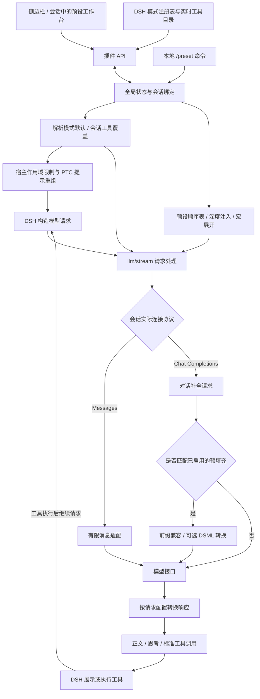

# DSH Preset Enhance

在 DeepSeek Harness 中导入、编辑和使用 SillyTavern 预设，并为不同模式、不同会话管理工具开关。

当前预览版已验证 DSH `0.1.6-alpha.2`、`0.1.7-alpha.1`、`0.1.7-alpha.2` 和 `0.1.7-rc.1`。

- 预设工作台：全局预设库、顺序编辑、消息预览、自动保存和单文件分享。
- 消息注入：聊天记录前后及指定深度的提示词、变量宏和 assistant 预填充。
- 工具管理：模式默认、会话覆盖、工具预设、用户分组与 MCP 服务分组。
- 接口兼容：对话补全接口支持预填充、DSML 工具调用转换和实验性正文提取；Messages 提供有限的预设注入兼容。

## 安装与上手

### DSH 0.1.6 / 0.1.7 预览版

安装当前预览版：

```powershell
dsh plugin --profile web add dsh-preset-enhance@0.3.3-rc.1
```

安装后重新启动 `dsh web`，侧边栏会出现“预设工作台”，新建对话的模式列表中会出现“预设模式”。

1. 打开工作台，导入 SillyTavern JSON 或 `.dsh-preset.json` 分享文件。导入的预设会保存到全局库，并成为当前默认。
2. 新建“预设模式”对话，自动启用当前默认预设。已有会话可用 `/preset on` 开启注入。
3. 检查提示词顺序与消息预览。如果最后一条消息是 assistant，请使用支持预填充的对话补全接口，并按需开启“预填充自动兼容”。
4. 在工具面板选择“模式默认”或“当前会话覆盖”，调整工具开关并保存。新策略从下一次请求生效。

### DSH 0.1.5

继续使用 DSH 0.1.5 时，固定安装原有 RC 版本：

```powershell
dsh plugin --profile web add dsh-preset-enhance@0.3.2-rc.2
```

当前版本声明的宿主范围为 `>=0.1.5-rc.2 <0.1.6`、`0.1.6-alpha.2`、`0.1.7-alpha.1`、`0.1.7-alpha.2` 与 `0.1.7-rc.1`。后续版本需重新验证。

## 连接协议与能力范围

DSH 0.1.6 的官方连接默认使用 Messages，0.1.7 更移除了官方的对话补全协议。工作台顶部现在选择**会话被路由到哪个连接**：插件自带的 DeepSeek Chat（预设增强）走对话补全接口，预填充续写、工具调用转换与正文提取都在这条路径上生效；宿主的官方连接走 Messages，这些能力不适用。切换在宿主的 provider/model 配置层完成，立即生效、无需重启，也不会改写官方连接的配置字段。它是连接级设置，会影响使用同一连接的其他会话。

| 能力 | 对话补全接口（Chat Completions） | Messages 接口 |
| --- | --- | --- |
| 预设消息注入 | 支持顺序表和深度注入 | 有限兼容，宿主可能重排或覆盖历史中段、末尾的 system 消息 |
| Assistant 预填充 | 接口支持时可用，可开启自动兼容 | 不支持，预填充设置面板禁用 |
| DSML 转换与正文提取 | 匹配预填充请求时可用 | 不应用 |
| 工具开关、分组与会话覆盖 | 支持 | 支持 |

插件会合并预设开头连续的 system 消息，避免 Messages 序列化只保留最后一条。需要准确保留预设消息顺序、使用预填充或正文提取时，请选择对话补全接口。无法识别当前连接时，工作台不会代选其他连接来修改。

## 预设工作台

### 预设库与会话

预设库支持导入、编辑、预览、导出和删除。最后选择的预设全局保存，重启后继续作为默认预设使用。 在会话中切换、导入、保存预设或设为默认时，也会同步该会话使用的预设，从下一次请求生效；会话原有的注入开关和角色变量会保留。重新打开工作台时优先显示当前会话绑定的预设。

“新会话自动启用预设注入”可以选择任意可用的 DSH 模式，保存后只影响之后新建的会话。“预设模式”始终自动启用；已有会话通过以下本地命令控制，命令不会发给模型：

| 命令 | 行为 |
| --- | --- |
| `/preset` | 切换当前会话的注入状态 |
| `/preset on` / `/preset off` | 开启 / 关闭注入 |
| `/preset status` | 查看当前状态 |

“预设模式”从宿主的 `standard` 模式生成，继承标准工具集，并移除 DSH 身份提示与运行环境快照。其他模式叠加预设时，由置顶的只读“DSH 系统提示词”条目控制是否保留模式原有提示；旧预设默认保留。关闭后，请求和预览也会过滤历史中已有的 DSH 系统提示与运行环境快照，不改写原始会话记录。

删除被默认设置或会话引用的预设时，插件会切换到另一个已保存预设；删除最后一个预设会关闭相关会话的注入。

### 提示词编辑

提示词分区按是否加入顺序表区分，和启用状态无关：

| 区域或条目 | 含义 |
| --- | --- |
| 顺序表内 | 已加入当前顺序表；关闭复选框只停用该条目，不会将其移出 |
| 闲置条目 | 尚未加入顺序表，不参与注入 |
| DSH 系统提示词 | 置顶的只读开关，控制其他模式的宿主提示词注入 |
| `chatHistory` | 从真实聊天记录读取内容的占位标记，正文不可编辑 |

支持 `chatHistory` 前后的 system、user、assistant/model 消息，以及按聊天深度注入。常用宏包括 `setvar`、`getvar`、全局变量、数值修改、随机选择与骰子。预设中的 `extensions` 原样保留，但不执行其扩展行为。

### 保存

全局自动保存开启后，预设正文、接口设置、自动启用模式、会话设置、工具开关和分组配置都会自动保存。关闭时使用各区域的保存按钮。

工具面板还提供独立的“自动保存工具开关”：仅自动保存逐工具及批量开关，分组名称、排序和成员编辑仍需手动保存，除非已开启全局自动保存。未确认的工具自动保存草稿会暂存在浏览器中，刷新或重新打开相同范围后可继续保存。

## 预填充与工具调用兼容

当最终注入消息是 assistant 时，包括顶层 `assistant_prefill` 或顺序表中的末尾 assistant/model 条目，工作台会显示预填充提醒，预览中标记为 `Assistant Prefix`。

在对话补全接口下开启“预填充自动兼容”，插件会为匹配到的末条 assistant 消息添加 `prefix: true`，处理 `<think>` 前缀及兼容接口的思考字段，并保留工具调用历史中的真实 `reasoning_content`。接口要求见 [DeepSeek 对话前缀续写文档](https://api-docs.deepseek.com/zh-cn/guides/chat_prefix_completion)。

### 地址与工具字段

| 请求目标与设置 | 处理方式 |
| --- | --- |
| DeepSeek 官方地址 | 匹配的预填充请求自动切换到 `https://api.deepseek.com/beta` |
| 非官方适配器地址 | 使用适配器实际请求地址，不改写地址，无需在工作台重复填写 |
| 开启“处理工具调用” | 官方与非官方地址均转换工具定义、调用历史和响应，并移除原生工具字段 |
| 关闭处理，使用官方 Beta | 移除 `tools`、`tool_choice` 和 `parallel_tool_calls` |
| 关闭处理，使用非官方地址 | 由“非官方接口移除原生工具字段”开关决定移除或原样发送 |

工具调用处理会将可用工具定义加入 system 提示，将历史调用与结果转换为 DSML。模型返回的 DSML 再恢复为标准 `tool_calls`，交给 DSH 执行，支持流式和非流式响应；工具结果中的常见 base64 图片也会转换为兼容的图片内容块。

### 正文提取与后续预填充

“正文/工具调用提取”是默认关闭的实验功能，使用结束思考标记、10 token 窗口和输出区标签兜底区分思考与正文，移除输出区控制标记，并恢复 DSML 工具调用。策略说明见 [预设稳定性实验](scripts/PRESET_STABILITY.md)。

开启时，格式提示词自动加入当前预设的 `chatHistory` 后方、assistant 预填充前，可在提示词列表中编辑。重复开启保留已有编辑；保存接口设置时会一并保存当前预设。

“工具调用后继续请求的预填充”默认继承原预设，也可填写独立提示词，支持变量宏和 `<think>` 前缀。开启自动兼容后，它只替换同一轮工具执行后继续请求的末条预填充；新一轮用户消息仍使用原预设。留空或展开为空时继续继承。

上述接口设置全局保存，从下一次请求生效。预填充转换只作用于匹配当前会话末条 assistant 前缀的请求。

## 工具预设与分组

### 生效范围

| 范围 | 生效规则 |
| --- | --- |
| 模式默认 | 为每个 DSH 模式选择自定义开关或工具预设，没有会话覆盖时采用此策略 |
| 当前会话覆盖 | 完整替换模式默认策略，可在同一会话内随时变更 |
| 恢复继承 | 移除会话覆盖，重新使用模式默认 |

工具目录从宿主模式注册表、模式作用域和当前会话实时获取，兼容其他插件引入的模式与工具。保存后从下一次请求生效；暂时缺失的工具引用会保留，待对应插件恢复后重新匹配。

工具预设支持新建、复制、重命名和删除，可以被多个模式或会话引用。修改预设会影响所有引用者的后续请求。删除仍被引用的预设时，模式回到自定义、会话回到继承，并保留原有逐工具策略数据。直接保存工具开关会将当前范围切换为自定义策略。

### 用户分组与 MCP

- 按 MCP 服务自动生成“服务名 · MCP”分组，也可将 MCP 工具加入用户分组。点击“刷新工具列表”重新读取动态工具目录。
- 用户分组支持名称、排序和成员编辑；同一工具最多属于一个用户分组。固定标签提供“全部”和“未分组”。
- 分组支持三态开关，以及全开、全关、仅启用此组和恢复预设值。顶部全选 / 全不选作用于当前模式全部工具，不受标签筛选影响。
- 标签栏保持单行横向滚动，也可折叠为下拉框；窄屏自动使用下拉框。MCP 服务名过长时从中间省略，保留首尾，完整名称可在悬浮提示或下拉框中查看。

关闭工具后，插件过滤请求中的工具定义，并通过执行守卫拒绝调用。在 DSH 0.1.6 中，可限制的继承工具还会通过宿主作用域限制从 PTC（程序式工具调用）的 SDK 提示中移除。宿主保留的 `run_code` 入口不会被关闭；宿主不允许限制的会话本地工具仍由执行守卫约束。

## 单文件分享与数据保存

工作台可导入、导出 `.dsh-preset.json`，也可导出普通 ST JSON。

| 内容 | 分享文件中的行为 |
| --- | --- |
| ST 预设 | 包含完整提示词与顺序表 |
| 预填充接口配置 | 随文件携带，导入后需手动“应用包内接口设置（全局）” |
| 工具预设与分组 | 默认导出当前关联的工具预设及分组，导入后需手动应用工具配置 |
| 会话 ID、模式和会话选择、目录缓存、引用计数 | 不导出 |
| 浏览器折叠状态、最后工具模式、自动保存开关及待保存草稿 | 不导出 |

未知工具格式子版本仍可导入、编辑和再次导出，但不能应用工具配置。字段定义见 [单文件格式说明](PRESET_FORMAT.md)。

预设库、默认选择、会话绑定、接口设置和工具策略默认保存在 `DSH_HOME/preset-enhance/state.json`；未设置 `DSH_HOME` 时使用用户目录下的 `.dsh`。浏览器只保存界面偏好、自动保存开关和待确认的工具草稿。

## 插件逻辑架构

插件分为工作台、状态与策略、请求处理三部分。预设注入和工具策略独立生效：关闭预设注入后，模式或会话的工具策略仍然有效。



工具执行守卫是独立的最后一道校验：即使历史中已有工具调用，或模型自行生成调用，也会检查当前工具策略。编辑器保留完整的工具目录，不会因某工具被关闭就让它从可编辑列表中消失。

### 代码对应关系

| 模块 | 职责 |
| --- | --- |
| `client.js`、`web/` | 侧边栏与会话入口，预设编辑、预览、工具管理和保存交互 |
| `src/index.mts`、`src/mode.mts` | 插件入口、API、命令、请求拦截、预设模式与生命周期管理 |
| `src/lib/store.mts`、`src/lib/preset-package.mts` | 状态持久化、版本校验、单文件导入导出 |
| `src/lib/preset.mts`、`src/lib/macros.mts` | 顺序表、深度注入、变量宏、最终消息和预填充判定 |
| `src/lib/tool-presets.mts`、`src/lib/tool-restrictions.mts` | 工具策略、分组、会话作用域限制和 PTC 工具可见性 |
| `src/lib/connection.mts`、`src/lib/protocol.mts`、`src/lib/messages.mts` | 读取实际连接协议、记录协议观察结果、Messages 消息适配 |
| `src/lib/deepseek-beta.mts`、`src/lib/toolcall-prefill.mts`、`src/lib/output-extractor.mts` | 请求匹配、预填充兼容、DSML 转换和实验性正文提取 |

宿主侧以 `src/**/*.mts` 为源码，构建后生成发布包使用的 `index.mjs`、`mode.mjs` 和 `lib/*.mjs`；工作台与客户端入口使用 JavaScript。

### 启动与运行时启停

初始化会读取状态并根据宿主的 `standard` 组成注册预设模式。状态损坏、模式组成缺失或目录不可写时，插件保留工作台并显示原因，停止注入和写入，不自动清空数据。修复后重新启用即可。

停用时停止接受新操作，等待在途写入和流式请求收尾，再释放请求桥接。插件不可用时，预设模式会明确拒绝使用。运行时启停与升级安装包是不同操作，安装或升级后仍按安装步骤重启宿主。

## 开发与验证

```powershell
npm install
npm run build       # 类型检查并生成发布用 JavaScript
npm test            # 本地回归用例
npm run pack:check  # 检查 npm 打包内容
```

本地双协议端点可用于观察 Chat Completions 与 Messages 的流式响应和请求记录：

```powershell
node tests/fixtures/protocol-server.mjs --demo
node tests/fixtures/protocol-server.mjs
```

具备本机沙盒环境时，`npm run test:mcp:candidate` 可在 **candidate 槽位**启动两个隔离的 stdio MCP 服务，检查发现、调用和分组；结束后关闭测试服务，不写入 candidate 配置。

## 许可证

[MIT](LICENSE)
