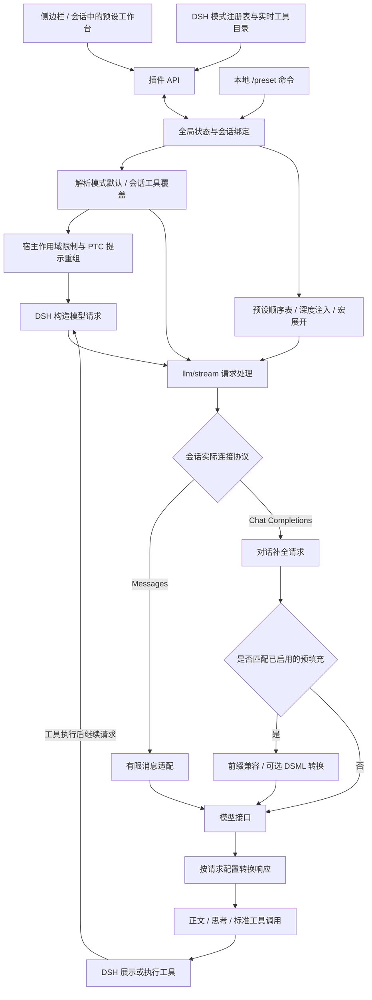

# 插件逻辑架构

插件分为工作台、状态与策略、请求处理三部分。预设注入和工具策略独立生效：关闭预设注入后，模式或会话的工具策略仍然有效。

工具执行守卫是独立的最后一道校验：即使历史中已有工具调用，或模型自行生成调用，也会检查当前工具策略。编辑器保留完整的工具目录，不会因某工具被关闭就让它从可编辑列表中消失。

### 代码对应关系

| 模块 | 职责 |
| --- | --- |
| `client.js`、`web/` | 侧边栏与会话入口，预设编辑、预览、工具管理和保存交互 |
| `src/index.mts`、`src/mode.mts` | 插件入口、API、命令、请求拦截、预设模式与生命周期管理 |
| `src/lib/store.mts`、`src/lib/preset-package.mts` | 状态持久化、版本校验、单文件导入导出 |
| `src/lib/dsh-system-template.mts`、`src/lib/request-settings.mts`、`src/lib/buffered-response.mts` | 模式系统模板、动态 DSH 宏、请求参数与非流式响应接入 |
| `src/lib/preset.mts`、`src/lib/macros.mts` | 顺序表、深度注入、变量宏、最终消息和预填充判定 |
| `src/lib/tool-presets.mts`、`src/lib/tool-restrictions.mts` | 工具策略、分组、会话作用域限制和 PTC 工具可见性 |
| `src/lib/connection.mts`、`src/lib/protocol.mts`、`src/lib/messages.mts` | 读取实际连接协议、记录协议观察结果、Messages 消息适配 |
| `src/lib/deepseek-beta.mts`、`src/lib/toolcall-prefill.mts`、`src/lib/output-extractor.mts` | 请求匹配、预填充兼容、DSML 转换和实验性正文提取 |

宿主侧以 `src/**/*.mts` 为源码，构建后生成发布包使用的 `index.mjs`、`mode.mjs` 和 `lib/*.mjs`；工作台与客户端入口使用 JavaScript。

### 启动与运行时启停

初始化会读取状态并根据宿主的 `standard` 组成注册预设模式。状态损坏、模式组成缺失或目录不可写时，插件保留工作台并显示原因，停止注入和写入，不自动清空数据。修复后重新启用即可。

停用时停止接受新操作，等待在途写入和流式请求收尾，再释放请求桥接。插件不可用时，预设模式会明确拒绝使用。运行时启停与升级安装包是不同操作，安装或升级后仍按安装步骤重启宿主。

